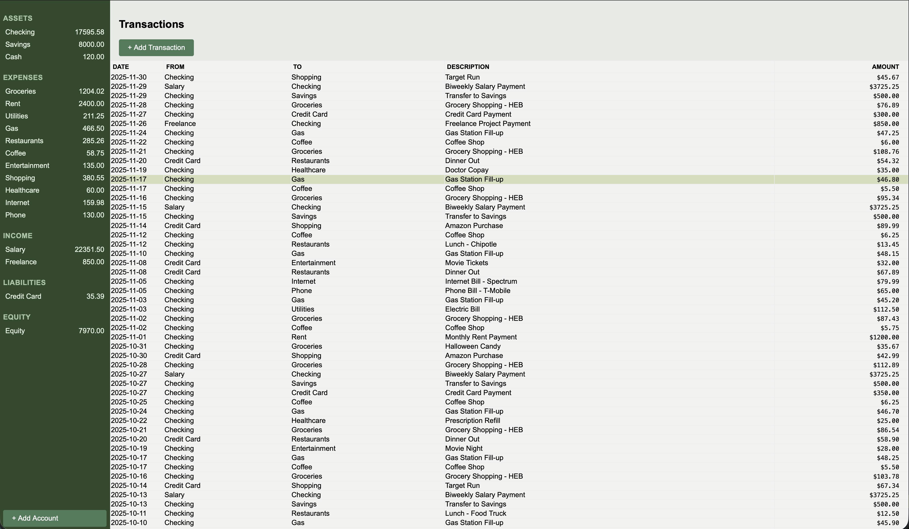
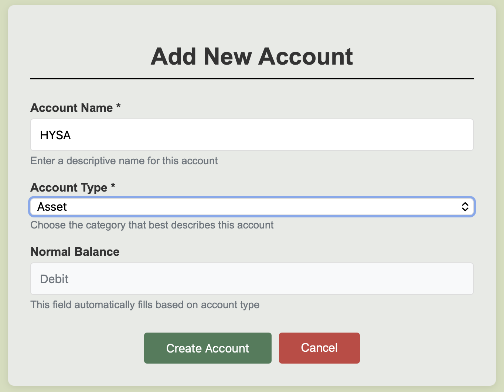
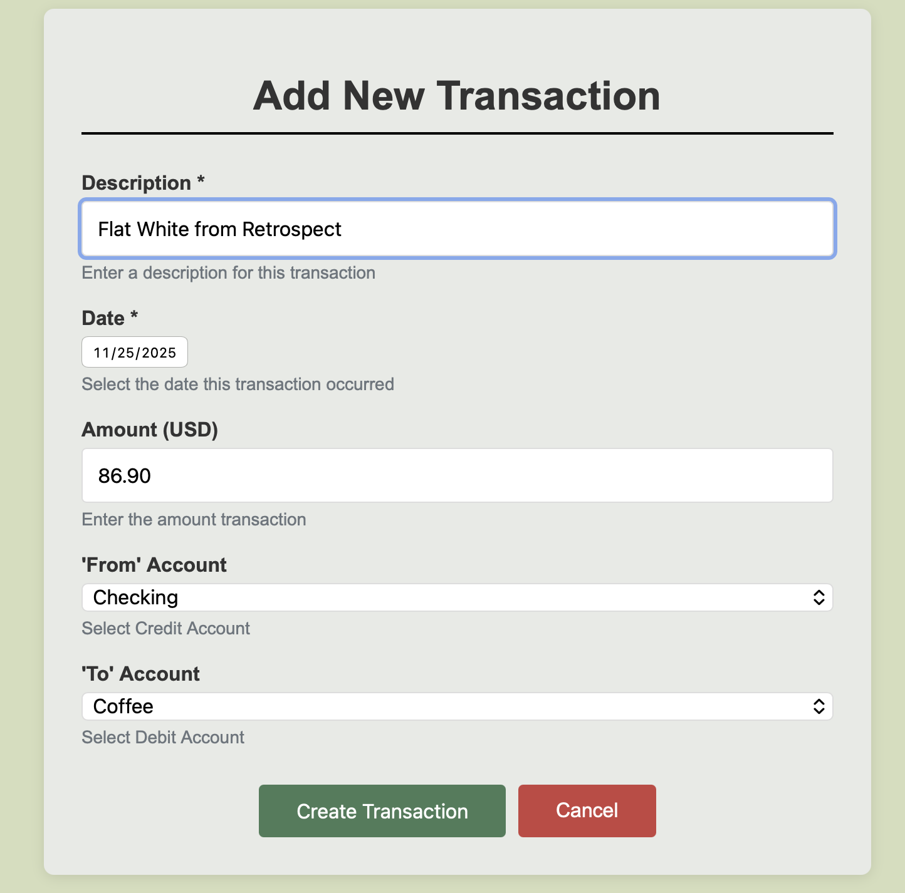

#  Penny

A clean, simple personal finance tracker using double-entry bookkeeping principles.





## Features

- **Account Management**: Track assets, liabilities, income, expenses, and equity accounts
- **Transaction Logging**: Record financial transactions with proper double-entry accounting principles.
- **Real-time Balance Calculation**: Account balances update automatically based on transactions
- **Clean Interface**: Sidebar navigation with organized account categories
- **Transaction History**: Log of all financial activity

## Tech Stack

**Backend:**
- Python 3.x
- Flask (web framework)
- SQLAlchemy (ORM)
- SQLite (database)

**Frontend:**
- HTML/CSS
- Jinja2 templates
- JavaScript

## Installation

1. Clone the repository:
```bash
   git clone https://github.com/christianlaverde/penny.git
   cd penny
```

2. Create a virtual environment and install dependencies:
```bash
   python -m venv venv
   source venv/bin/activate  # On Windows: venv\Scripts\activate
   pip install -r requirements.txt
```

3. Set up environment variables:
```bash
   cp .env.example .env
   # Edit .env and update SECRET_KEY with a secure random string
```

4. Run the application:
```bash
   python app.py
```

5. Open your browser to `http://localhost:5001`

**Note:** Set `APP_ENV=DEV` in your `.env` file to populate with sample data for testing and change `DATABASE_URI` to avoid data loss.

## Usage

### Managing Accounts
- **Create Account**: Click "New Account" in the sidebar to add assets, expenses, income, liabilities, or equity accounts
- **View Balances**: All accounts display with real-time balances in the sidebar, organized by category
- **Edit/Delete**: Right-click any account to rename or remove it

### Recording Transactions
- **Add Transaction**: Click "New Transaction" to record a financial event
- **Double-Entry System**: Each transaction requires both a debit and credit account, ensuring books always balance
- **Transaction History**: View all transactions in chronological order on the main dashboard
- **Edit/Delete**: Use the action buttons on each transaction to modify or remove entries

### Understanding Double-Entry Bookkeeping
Penny uses traditional accounting principles:
- **Assets & Expenses**: Increase with debits, decrease with credits
- **Liabilities, Equity & Income**: Increase with credits, decrease with debits

## Future Improvements

- **Budget Planning**: Set monthly budgets for expense categories and track spending against targets
- **Advanced Filtering**: Search and filter transactions by date range, account, amount, or description
- **Financial Reporting**: Generate monthly summaries, spending breakdowns by category, and visual charts for better financial insights

## License

[Optional - MIT is common for personal projects]
